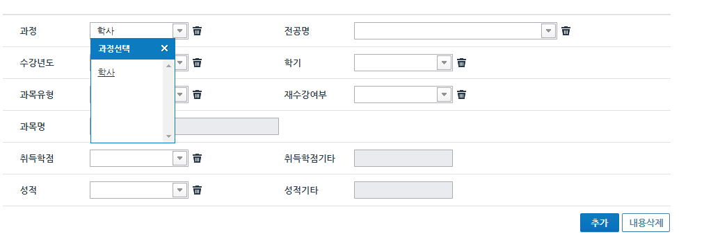

# samsung_apply_fill_macro
삼성 채용 성적 입력 매크로  
테스트 환경: `Windows10 Chrome`
> 간단히 테스트 해보고 안되면 손으로 입력...

# How to use

1. data_sample에 맞게 성적 엑셀 입력
2. data.xlsx로 파일명 수정
3. run.py 실행
4. 3초내로 이수교과목 페이지 과정탭에서 열어주고 엔터

---
4번 과정 이미지
  
 

link:  https://jaehunsim.tistory.com/40

src: https://github.com/JaehunSim/samsung_apply_fill_macro

